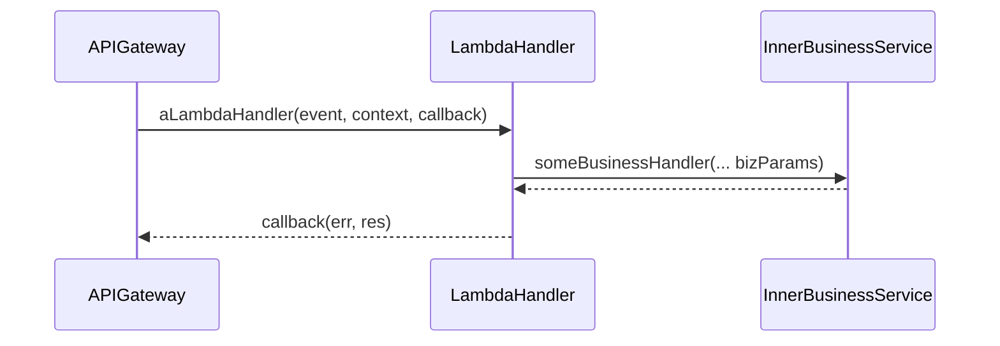
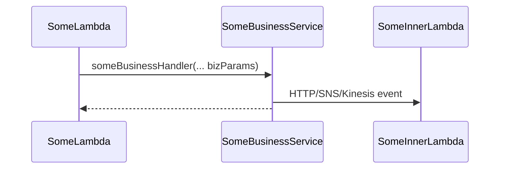

# benie-lambda-lib
This library is a toolbox for creating AWS Lambda handlers that provides tooling and automation for:

- structured logging and serialization of both _incoming events_ and _responses_;
- exception handling;
- remote calls to other lambda APIs (via HTTP, SNS or Kinesis), with automated
-- Correlation id propagation
-- Request and response logging
-- AWS X-Ray instrumentation

## Usage

### Lambda Handler Builder
Supose you have a business logic module (_myServiceModule_ in the example below) and must give an http endpoint to it, like so:


In such case, you might use EventHandlerBuilder:

```javascript
exports.myLambdaHandler = new EventHandlerBuilder()
	.withHandler(myServiceModule.someBusinessHandler)
	.withStaticParams('myParam1', myParam2)
	.build();
```

_This will return a lambda handler similar to the following:_
```javascript
exports.myLambdaHandler = async (event, context, callback) => {
	try {
		//... do some logging and event pre-processing
		let result = myServiceModule.someBusinessHandler('myParam2', myParam2);
		//... do some logging and success post-processing
		callback(null, result);
	} catch(e) {
		//... do some logging and error post-processing
		callback(errorResult);
	}
}
```

#### Event parsing
Most of the times, you may not have static parameters to your inner service call. You may get such values from the incoming event like such:
```javascript
exports.myLambdaHandler = new EventHandlerBuilder()
	.withHandler(myServiceModule.someBusinessHandler)
	.withEventParams(e => [e.body.some, e.queryStringParams.someOther])
	.build();
```
_This would be similar to:_
```javascript
exports.myLambdaHandler = async (event, context, callback) => {
	try {
		let param1 = JSON.parse(event.body).some;
		let param2 = event.querystringParams.someOther
		let result = myServiceModule.someBusinessHandler(param1, param2);
		callback(null, result);
	} catch(e) {
		//...
	}
}
```
> Note that _event.body_ is automatically parsed, but only if it's headers include _content-type=application/json_

### Error handling
#### Handled Business Exceptions
TODO
#### Unhandled Business Exception
TODO

### Provided Clients: cascading function calls
Now let's assume your lambda or business logic may need to access some other lambda. Using the provided clients ensures these calls will be logged in a standard and structured manner, and that will propagate logging settings and correlation id's.



- HTTP
```javascript
const { httpClient, RemoteException } = require('benie-lambda-lib').Clients;

try {
	let response = await httpClient.makeRequest('GET', 'https://my.service/foo');
} catch(e) {
	if(e instanceof RemoteException) {
		let {statusCode, errorCode, message} = e;
	}
}
```

- SNS
```
//TODO
```

- Kinesis
```
//TODO
```

#### Log
You must set the log level in lambda's environment variable __process.env.LOG_LEVEL__, and it must be either _DEBUG, INFO, WARN or ERROR_. The default value is _DEBUG_.

Using the __service builder__ and __client libraries__, it will be automatically logged:

-	Incoming Events
- Outgoing HTTP, SNS and Kinesis events
- Incoming HTTP responses
- Outgoing service responses (callback)

```json
//example log output for the cascading function calls scenario: 
{"message":"LAMBDA EVENT RECEIVED","level":"INFO","awsRegion":"us-west-2","awsRequestId":"myAwsRequestId","x-correlation-id":"myAwsRequestId","Debug-Log-Enabled":"true","httpMethod":"GET","headers":{}}
{"message":"HTTP REQUEST","level":"DEBUG","awsRegion":"us-west-2","x-correlation-id":"myAwsRequestId","x-correlation-myKey":"myVal","hostname":"my.host","path":"/foo","port":null,"method":"GET","headers":{"x-correlation-id":"myCorrelationId","x-correlation-myKey":"myVal"}}
{"message":"HTTP RESPONSE","level":"DEBUG","awsRegion":"us-west-2","x-correlation-id":"myAwsRequestId","x-correlation-myKey":"myVal","statusCode":200,"body":"{}","headers":{"content-type":"application/json"}}
{"message":"LAMBDA RESPONSE","level":"INFO","awsRegion":"us-west-2","awsRequestId":"myAwsRequestId","x-correlation-id":"myAwsRequestId","Debug-Log-Enabled":"true","statusCode":200,"headers":{"Content-Type":"application/json","Access-Control-Allow-Credentials":true}}
```

#### Correlation IDs
If the remote lambda is build using this lambda-builder, they will log the same correlation ID in the incoming event, and you will be able to __track a long-living business event__ in the logs of every function involved.


